# 🚀 DEPLOYMENT AUTOMATION - IMPLEMENTATION COMPLETE

**Date:** October 16, 2025  
**Status:** ✅ Production-Ready Deployment System Implemented  
**Components:** Bash scripts, PM2 config, Docker setup, Health checks

---

## ✅ IMPLEMENTED COMPONENTS

### 1. **Automated Deployment Script** ✅
- **File:** `infinity-storm-server/deploy/deploy.sh`
- **Features:**
  - ✅ Environment validation (Node.js, npm, PostgreSQL)
  - ✅ Automatic backups before deployment
  - ✅ Git-based code deployment
  - ✅ Dependency installation (npm ci)
  - ✅ Database migration execution
  - ✅ Application build (if needed)
  - ✅ Zero-downtime restart
  - ✅ Health check validation
  - ✅ Automatic rollback on failure
  - ✅ Backup rotation (keeps last 5 versions)

**Commands:**
```bash
./deploy.sh deploy           # Deploy latest code
./deploy.sh rollback <ID>    # Rollback to backup
./deploy.sh health           # Health check
./deploy.sh backup           # Create backup only
./deploy.sh list-backups     # List backups
./deploy.sh start/stop/restart  # Service management
```

### 2. **PM2 Process Manager Configuration** ✅
- **File:** `infinity-storm-server/ecosystem.config.js`
- **Features:**
  - ✅ Cluster mode for multi-core utilization
  - ✅ Auto-restart on crash
  - ✅ Memory limit (1GB) with auto-restart
  - ✅ Log rotation and management
  - ✅ Environment-specific configs (prod/staging/dev)
  - ✅ Daily restart cron (3 AM)
  - ✅ Graceful shutdown handling
  - ✅ Zero-downtime reload

**Usage:**
```bash
pm2 start ecosystem.config.js --env production
pm2 reload ecosystem.config.js
pm2 stop infinity-storm
pm2 logs infinity-storm
pm2 monit
```

### 3. **Comprehensive Health Check Endpoint** ✅
- **Endpoint:** `/health` (detailed) and `/healthz` (simple)
- **Checks:**
  - ✅ PostgreSQL connectivity
  - ✅ Redis connectivity (if enabled)
  - ✅ Memory usage monitoring
  - ✅ Application uptime
  - ✅ Environment information
  - ✅ Version reporting

**Response Example:**
```json
{
  "status": "healthy",
  "timestamp": "2025-10-16T14:30:22.123Z",
  "uptime": 3600,
  "environment": "production",
  "version": "1.0.0",
  "checks": {
    "database": {
      "status": "healthy",
      "message": "PostgreSQL connected"
    },
    "redis": {
      "status": "healthy",
      "message": "Redis connected"
    },
    "memory": {
      "status": "healthy",
      "heapUsed": "256MB",
      "heapTotal": "512MB",
      "rss": "384MB",
      "percentage": "25.00%"
    }
  }
}
```

### 4. **Docker Production Setup** ✅
- **Files:**
  - `Dockerfile.production` - Multi-stage optimized image
  - `docker-compose.production.yml` - Full stack orchestration

**Features:**
  - ✅ Multi-stage build for smaller image size
  - ✅ Non-root user execution (security)
  - ✅ Health checks built-in
  - ✅ Resource limits (CPU/memory)
  - ✅ Automatic restart policies
  - ✅ Network isolation
  - ✅ Volume management for persistence
  - ✅ Nginx reverse proxy support

**Usage:**
```bash
# Build and start
docker-compose -f docker-compose.production.yml up -d

# Scale application
docker-compose -f docker-compose.production.yml up -d --scale infinity-storm=3

# View logs
docker-compose -f docker-compose.production.yml logs -f

# Stop all services
docker-compose -f docker-compose.production.yml down
```

---

## 📊 DEPLOYMENT WORKFLOW

### Standard Deployment Flow

```mermaid
graph TD
    A[Start Deployment] --> B[Validate Environment]
    B --> C[Create Backup]
    C --> D[Pull Latest Code]
    D --> E[Install Dependencies]
    E --> F[Run Migrations]
    F --> G[Build Application]
    G --> H[Restart Service]
    H --> I[Health Check]
    I -->|Pass| J[Deployment Complete ✅]
    I -->|Fail| K[Auto Rollback]
    K --> L[Restore Backup]
    L --> M[Restart Service]
    M --> N[Deployment Failed ❌]
```



### Zero-Downtime Deployment

1. **PM2 Cluster Mode:** Multiple instances running
2. **Rolling Restart:** Instances restarted one at a time
3. **Health Check:** Each instance validated before traffic
4. **Load Balancing:** Traffic distributed across healthy instances

---

## 🔧 DEPLOYMENT ENVIRONMENTS

### Development
```bash
NODE_ENV=development
PORT=3001
# Less strict security
# More verbose logging
# Hot reload enabled
```

### Staging
```bash
NODE_ENV=staging
PORT=8081
# Production-like security
# Detailed logging
# Performance monitoring
```

### Production
```bash
NODE_ENV=production
PORT=8080
# Full security hardening
# Minimal logging
# Performance optimized
```

---

## 📋 PRE-DEPLOYMENT CHECKLIST

### Infrastructure
- [ ] Server provisioned (min 2GB RAM, 2 CPU cores)
- [ ] Node.js 18+ installed
- [ ] PostgreSQL 15+ installed and configured
- [ ] Redis installed (optional but recommended)
- [ ] PM2 installed globally (`npm install -g pm2`)
- [ ] SSL certificate obtained (Let's Encrypt or purchased)
- [ ] Firewall configured (ports 80, 443, 8080)
- [ ] DNS records updated
- [ ] Backup storage configured

### Environment Configuration
- [ ] `.env.production` file created
- [ ] JWT_SECRET generated (256-bit random)
- [ ] Database credentials configured
- [ ] Supabase keys set
- [ ] Redis credentials set (if using)
- [ ] CORS origins configured
- [ ] Rate limits configured

### Security
- [ ] HTTPS enforcement enabled
- [ ] Security headers configured
- [ ] Rate limiting enabled
- [ ] IP blacklist configured
- [ ] Secrets stored securely (Vault recommended)
- [ ] Database encrypted at rest
- [ ] Firewall rules applied

### Monitoring & Logging
- [ ] Log directory created (`/var/log/infinity-storm`)
- [ ] Log rotation configured (logrotate)
- [ ] PM2 monitoring enabled (`pm2 monitor`)
- [ ] Health check endpoint accessible
- [ ] Alerting configured (email/SMS/Slack)
- [ ] APM tool integrated (optional: New Relic, Datadog)

---

## 🚀 DEPLOYMENT COMMANDS

### Initial Deployment (First Time)
```bash
# 1. Clone repository
git clone https://github.com/yourusername/infinity-storm.git
cd infinity-storm

# 2. Create environment file
cp .env.example .env.production
nano .env.production  # Edit with production values

# 3. Run deployment script
chmod +x infinity-storm-server/deploy/deploy.sh
./infinity-storm-server/deploy/deploy.sh deploy

# 4. Verify deployment
curl http://localhost:8080/health
pm2 status
pm2 logs infinity-storm
```

### Subsequent Deployments
```bash
# Standard deployment (with auto-backup and rollback)
./infinity-storm-server/deploy/deploy.sh deploy

# Or using PM2 directly
cd /var/www/infinity-storm/infinity-storm-server
git pull origin main
npm ci --production
npm run migrate
pm2 reload ecosystem.config.js
```

### Rollback
```bash
# List available backups
./deploy.sh list-backups

# Rollback to specific backup
./deploy.sh rollback 20251016-143022
```

### Docker Deployment
```bash
# Build and deploy with Docker
docker-compose -f docker-compose.production.yml build
docker-compose -f docker-compose.production.yml up -d

# Check status
docker-compose -f docker-compose.production.yml ps
docker-compose -f docker-compose.production.yml logs -f infinity-storm
```

---

## 🔍 POST-DEPLOYMENT VERIFICATION

### 1. Health Check
```bash
curl -i http://localhost:8080/health
# Expected: 200 OK with detailed health status
```

### 2. Service Status
```bash
pm2 status
# Expected: infinity-storm running, 0 restarts
```

### 3. Logs Check
```bash
pm2 logs infinity-storm --lines 50
# Expected: No errors, "Server started" message
```

### 4. Database Connectivity
```bash
psql $DATABASE_URL -c "SELECT COUNT(*) FROM players;"
# Expected: Query executes successfully
```

### 5. API Endpoints
```bash
# Test demo spin
curl -X POST http://localhost:8080/api/demo-spin \
     -H "Content-Type: application/json" \
     -d '{"betAmount": 1.0, "quickSpinMode": false}'
# Expected: 200 OK with spin result
```

### 6. Performance Check
```bash
# Response time check
time curl -s http://localhost:8080/health > /dev/null
# Expected: < 100ms

# Memory usage
pm2 info infinity-storm | grep memory
# Expected: < 500MB per instance
```

---

## 📊 MONITORING & MAINTENANCE

### PM2 Monitoring
```bash
# Real-time monitoring
pm2 monit

# Detailed info
pm2 info infinity-storm

# Log files
pm2 logs infinity-storm --lines 100
pm2 flush  # Clear logs
```

### System Resource Monitoring
```bash
# CPU and memory
top -p $(pm2 pid infinity-storm)

# Disk usage
df -h /var/www/infinity-storm
du -sh /var/log/infinity-storm
```

### Database Monitoring
```bash
# Active connections
psql $DATABASE_URL -c "SELECT count(*) FROM pg_stat_activity;"

# Table sizes
psql $DATABASE_URL -c "
  SELECT tablename, pg_size_pretty(pg_total_relation_size(schemaname||'.'||tablename)) 
  FROM pg_tables WHERE schemaname='public';
"
```

### Automated Monitoring
```bash
# Set up cron job for health checks
crontab -e

# Add:
*/5 * * * * curl -f http://localhost:8080/health || echo "Health check failed" | mail -s "Alert: Infinity Storm Down" admin@infinitystorm.com
```

---

## 🚨 TROUBLESHOOTING

### Deployment Fails

**Problem:** `git pull` fails  
**Solution:**
```bash
cd /var/www/infinity-storm
git stash  # Save local changes
git pull origin main
git stash pop  # Restore local changes
```

**Problem:** npm install fails  
**Solution:**
```bash
rm -rf node_modules package-lock.json
npm cache clean --force
npm install --production
```

**Problem:** Health check fails after deployment  
**Solution:**
```bash
# Check logs
pm2 logs infinity-storm --err

# Check if service is running
pm2 status

# Manual restart
pm2 restart infinity-storm

# If still failing, rollback
./deploy.sh rollback <last-good-backup-id>
```

### Service Won't Start

**Problem:** Port already in use  
**Solution:**
```bash
# Find process using port 8080
lsof -i :8080
# Kill the process
kill -9 <PID>
# Restart
pm2 restart infinity-storm
```

**Problem:** Database connection fails  
**Solution:**
```bash
# Test database connectivity
psql $DATABASE_URL -c "SELECT 1;"

# Check PostgreSQL status
sudo systemctl status postgresql

# Restart PostgreSQL if needed
sudo systemctl restart postgresql
```

---

## 🔄 MAINTENANCE SCHEDULE

### Daily
- [x] Automated health checks (every 5 minutes)
- [x] Log monitoring for errors
- [x] Performance metrics review

### Weekly
- [ ] Database backup verification
- [ ] Security log review
- [ ] Performance optimization check
- [ ] Dependency updates check (`npm outdated`)

### Monthly
- [ ] Full system backup
- [ ] Security patch updates
- [ ] Load testing
- [ ] Capacity planning review

### Quarterly
- [ ] Disaster recovery drill
- [ ] Security audit
- [ ] Performance benchmark
- [ ] Infrastructure review

---

## ✅ SIGN-OFF

**Deployment Automation:** ✅ Complete and Production-Ready  
**Implementation Date:** October 16, 2025  
**Implemented By:** Development Team  
**Components Delivered:**
- ✅ Bash deployment script
- ✅ PM2 ecosystem configuration
- ✅ Docker production setup
- ✅ Health check endpoints
- ✅ Comprehensive documentation

**Production Ready:** ✅ YES (after infrastructure provisioning)  
**Next Steps:** Infrastructure setup, SSL certificate, production deployment

---

**READY FOR PRODUCTION DEPLOYMENT** 🚀


