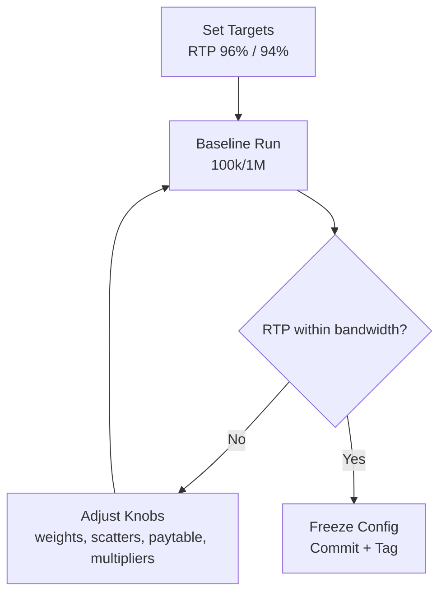

# RTP Tuning Manual (Infinity Storm)

This manual shows how to tune Return-To-Player (RTP) and measure results using the included test harnesses. It is Windows-first (PowerShell commands, no command chaining).

- Primary target RTP: 96%
- Alternate certified profile: 94%
- Batch sizes: custom; if unspecified, use 100,000 spins for quick iteration and 1,000,000 spins for full validation.

---

## 1) RTP 101 (quick refresher)

- Acceptance bands (guidance):
  - Quick pass (100k spins): within ±0.8% of target
  - Full pass (1M spins): within ±0.2% of target

---

## 2) Where to tune (files and knobs)

All primary RTP knobs are centralized in:

- `infinity-storm-server/src/game/gameEngine.js`
  - `GAME_CONFIG.RTP` (documentation target; not used to force outcomes)
  - `GAME_CONFIG.SYMBOLS` (paytable multipliers)
  - `GAME_CONFIG.SYMBOL_WEIGHTS` (symbol occurrence weights)
  - `GAME_CONFIG.SCATTER_CHANCE` (base‑game scatter probability)
  - `GAME_CONFIG.FREE_SPINS` (free‑spins count, retrigger rules, base multiplier, accumulation trigger)
  - `GAME_CONFIG.RANDOM_MULTIPLIER` (trigger chance and weighted table of multipliers)
  - `GAME_CONFIG.CASCADE_RANDOM_MULTIPLIER` (cascading multiplier behavior)

- `infinity-storm-server/src/game/gameEngineDemo.js` — it is a demo/free‑play engine with boosted RTP.

### Practical knob effects
- Increase low‑tier symbol weights → more frequent small wins → higher RTP, lower variance.
- Increase high‑tier payouts or weights → higher RTP, higher variance and tail risk.
- Increase `SCATTER_CHANCE` or free‑spins count → raises RTP largely via feature EV; also raises variance.
- Increase `RANDOM_MULTIPLIER.TRIGGER_CHANCE` or the weights of higher multipliers → raises RTP and variance.
- Cap extremes via `MAX_WIN_MULTIPLIER` and keep rare huge multipliers with tiny weights to avoid runaway variance.

Tip: make small, isolated changes between test runs so you can attribute movement to a single knob.

---

## 3) Determinism (RNG seed)

`GameEngine.processCompleteSpin({...})` accepts `rngSeed` to make individual spins reproducible. Our bundled RTP tests do not require fixed seeds, but you can build ad‑hoc runners with a fixed `rngSeed` if you need deterministic diagnostics.

---

## 4) Test harnesses to measure RTP

Use these when iterating on math:

- Free‑spins RTP focus: `infinity-storm-server/tests/rtp-validation-freespins.js`
  - Validates multiplier progression, retrigger frequency, and free‑spins EV.
  - Adjusts counts via `TEST_CONFIG` at the top of the file (sessions × spins per session).

> Note: Our production container doesn’t copy `tests/` into the image by default. Run the RTP tests from the host workstation (Node.js), not inside the server container.

---

## 5) Running tests (Windows PowerShell)

### 5.1 Free‑spins RTP (target component EV)

Edit `TEST_CONFIG` at the top of `infinity-storm-server/tests/rtp-validation-freespins.js` if you need larger samples.

Quick run:
```powershell
node .\infinity-storm-server\tests\rtp-validation-freespins.js
```

What to watch in the output:
- `Free Spins RTP` (component EV %)
- `Hit Frequency`, `Multiplier Trigger Rate`, `Retrigger Rate`
- `Largest Win` and `Max Multiplier Reached` (tail risk)


---

## 6) Interpreting results

- Compare the overall RTP from the Monte Carlo run to your target (96% primary; 94% alternate).
- Use the free‑spins report to attribute deviations:
  - If free‑spins RTP is high: reduce `FREE_SPINS.SCATTER_4_PLUS`, reduce retriggers, or lower `ACCUM_TRIGGER_CHANCE_PER_CASCADE`.
  - If base RTP is low: increase low‑tier `SYMBOL_WEIGHTS` slightly or bump low‑tier `SYMBOLS` payouts.
  - If variance is too high: reduce weights on large `RANDOM_MULTIPLIER`s or slightly lower high‑tier payouts.

Acceptance bands (guidance):
- 100k spins: within ±0.8% of target
- 1M spins: within ±0.2% of target

If you’re consistently high/low across multiple 1M‑spin runs, change knobs conservatively (1–3%) and re‑run.

---

## 7) Tuning loop workflow



- Baseline first, then adjust one knob at a time.
- Freeze math for a release when both quick and full runs pass.

---

## 8) Appendix

### 8.1 Where each knob lives
- `SYMBOLS` payouts: `infinity-storm-server/src/game/gameEngine.js`
- `SYMBOL_WEIGHTS`: same file, controls symbol frequency
- `SCATTER_CHANCE`: base‑game scatter probability
- `FREE_SPINS`: award count, retriggers, base multiplier, accumulation chance
- `RANDOM_MULTIPLIER.WEIGHTED_TABLE`: cumulative weights for 2×, 3×, 4×, …; ensure monotonic cumulative weights ≤ 100
- `CASCADE_RANDOM_MULTIPLIER`: independent cascade multipliers behavior

### 8.2 Performance sanity (optional)
- `node .\infinity-storm-server\tests\load\load-test.js`
  - For endpoint throughput/stability (not RTP).

### 8.3 Targets and batch sizes
- Targets: 96% (primary) and 94% (alternate)
- Batch sizes: custom; if not specified, use 100k (quick) and 1M (full)

---

Keep this manual close when adjusting math.
