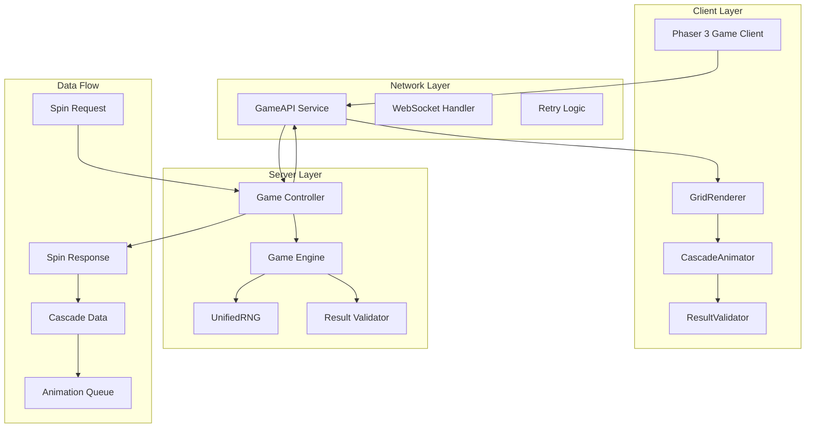
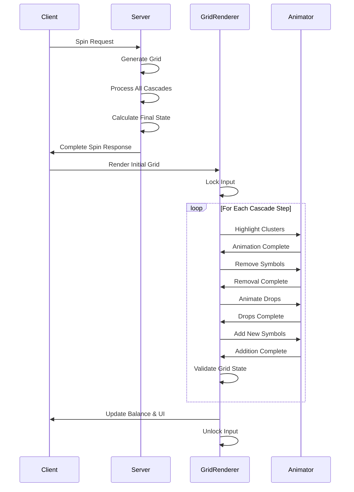

# Server-Client Separation Completion - Technical Design

## Executive Summary

This document provides the comprehensive technical design for completing the server-client separation of Infinity Storm casino game. The design emphasizes complete server authority for all game logic while maintaining seamless client animations and preventing race conditions through a sophisticated cascade synchronization protocol.

## Architecture Overview



## Core Design Principles

### 1. Server Authority
- **ALL** game logic calculations occur server-side
- Client receives complete calculation results
- No random number generation on client
- Server provides deterministic, auditable results

### 2. Race Condition Prevention
- Structured cascade data prevents timing mismatches
- Client animation locked to server sequence
- Checkpoints ensure state synchronization
- Recovery mechanisms for network issues

### 3. Performance Preservation
- Maintain 60 FPS client animations
- Sub-500ms server response times
- Efficient cascade data structures
- Optimized network payloads

## Detailed Component Design

### Server-Side Components

#### Enhanced Game Engine

```typescript
class GameEngine {
    private rng: UnifiedRNG;
    private gridGenerator: GridGenerator;
    private cascadeProcessor: CascadeProcessor;
    private winCalculator: WinCalculator;

    async processSpin(request: SpinRequest): Promise<SpinResult> {
        // 1. Generate seed and initialize RNG
        const seed = this.generateSecureSeed();
        this.rng = new UnifiedRNG(seed);

        // 2. Generate initial grid
        const initialGrid = this.gridGenerator.generate(this.rng);

        // 3. Process all cascades
        const cascadeSteps = await this.processCascades(initialGrid);

        // 4. Calculate final totals
        const totalWin = cascadeSteps.reduce((sum, step) => sum + step.winAmount, 0);

        // 5. Generate result with validation
        const result: SpinResult = {
            spinId: this.generateSpinId(),
            seed,
            initialGrid,
            cascadeSteps,
            totalWin,
            finalBalance: request.currentBalance + totalWin,
            checksum: this.generateChecksum(cascadeSteps),
            serverTimestamp: Date.now(),
            rngDrawCount: this.rng.getDrawCount(),
            processingTimeMs: performance.now() - startTime
        };

        return result;
    }

    private async processCascades(grid: Symbol[][]): Promise<CascadeStep[]> {
        const steps: CascadeStep[] = [];
        let currentGrid = grid;
        let stepIndex = 0;

        while (true) {
            // Find winning clusters
            const clusters = this.winCalculator.findWinningClusters(currentGrid);
            if (clusters.length === 0) break;

            // Calculate win amount
            const winAmount = this.winCalculator.calculatePayout(clusters);

            // Create removal grid
            const symbolsToRemove = clusters.flatMap(c => c.positions);
            const gridAfterRemoval = this.removeSymbols(currentGrid, symbolsToRemove);

            // Calculate dropping animations
            const droppingSymbols = this.calculateDropAnimations(gridAfterRemoval);

            // Generate new symbols
            const newSymbols = this.generateNewSymbols(gridAfterRemoval);
            const gridAfterDrop = this.applyNewSymbols(gridAfterRemoval, newSymbols);

            // Create cascade step
            const step: CascadeStep = {
                stepIndex,
                gridBefore: currentGrid,
                winningClusters: clusters,
                symbolsToRemove,
                gridAfterRemoval,
                droppingSymbols,
                newSymbols,
                gridAfterDrop,
                winAmount,
                multipliers: this.getActiveMultipliers(),
                totalWinSoFar: steps.reduce((sum, s) => sum + s.winAmount, winAmount)
            };

            steps.push(step);
            currentGrid = gridAfterDrop;
            stepIndex++;

            // Safety limit
            if (stepIndex >= 50) break;
        }

        return steps;
    }

    private calculateDropAnimations(grid: Symbol[][]): DropAnimation[] {
        const animations: DropAnimation[] = [];

        for (let col = 0; col < 6; col++) {
            const column = grid[col];
            let dropDistance = 0;

            for (let row = 4; row >= 0; row--) {
                if (column[row] === null) {
                    dropDistance++;
                } else if (dropDistance > 0) {
                    animations.push({
                        fromPosition: { col, row },
                        toPosition: { col, row: row + dropDistance },
                        symbol: column[row],
                        duration: 400 + (dropDistance * 50) // Longer drops take more time
                    });
                }
            }
        }

        return animations;
    }
}
```

## Port Unification (3000 Only)

- Single-port policy: serve the client and API from port `3000` to enforce same-origin and avoid CORS/localhost vs 127.0.0.1 drift.
- Host static client assets via the server (`express.static`) and deprecate any separate static/dev servers on `3001`.
- Remove `3001` from any CORS allowlists; retain only the deployed origin(s) and `http://localhost:3000` for local playtests.
- Update developer workflow to run only `infinity-storm-server/server.js`; the client loads from the same origin.
- Add `<script src="/socket.io/socket.io.js"></script>` in `index.html` ahead of network code to guarantee the global `io` is available for WebSocket flows when served by the server.

Rationale: same-origin removes an entire class of CORS/session/token leakage issues and ensures portal-first auth cookies/tokens align.

## API Contract Normalization

- Normalize HTTP and WebSocket payloads to a single canonical SpinResult shape (per this spec), so client code paths don’t branch.
- For `/api/spin`, return a top-level SpinResult object (no nested `{ player, spin }`) with:
  - `spinId, betAmount, initialGrid, cascadeSteps, finalGrid, totalWin, totalMultiplier, timing, metadata, balance`
  - Cascade steps: server-standardized fields `gridBefore, matches, gridAfter, win`
- Ensure compatibility shims only as a temporary client-side wrapper; the server should be the source of truth format.

## Route Consolidation and Auth

- Consolidate duplicate spin routes. Keep one authoritative `/api/spin` route (portal-first auth) and one `/api/demo-spin` for explicit demo/testing only.
- Remove overlapping or conflicting definitions (e.g., a public `/api/spin` in `server.js` and an authenticated `/api/spin` in `src/routes/api.js`).
- Align all client calls (HTTP + WS) to the same contract and feature flags (e.g., `quickSpinMode`, `freeSpinsActive`, `accumulatedMultiplier`).

## WebSocket Bootstrapping

- Guarantee `socket.io-client` availability through the server-served script: `<script src="/socket.io/socket.io.js"></script>` rather than relying on bundling.
- Keep `NetworkService` base URL derived from `window.location.origin` so same-origin use of 3000 “just works”.
- Remove any alternate global NetworkService variants to a single canonical implementation to avoid drift.

## Naming Consistency for Cascades

- Standardize field names across server components and responses:
  - `cascadeSteps` (not `cascades`)
  - Step fields: `gridBefore`, `matches`, `gridAfter`, `win`, plus `timing`
  - Match entries: `{ symbolType, positions[], payout, clusterSize }`
- Provide a thin server-side transformer to migrate legacy fields (e.g., `gridStateBefore/After` → `gridBefore/After`) until all code paths are updated.

## Testing and Ops Implications

- Update integration tests and any dev tooling to assume port `3000` only.
- Remove `http-server`-based dev scripts and rely on the Node server for local runs.
- Validate that HTTP and WS flows operate under same-origin without preflight.
- Add a smoke test that asserts the presence of `/socket.io/socket.io.js` and verifies a WebSocket handshake from the served client.

#### Cascade Data Structures

```typescript
interface CascadeStep {
    stepIndex: number;
    gridBefore: Symbol[][];
    winningClusters: Cluster[];
    symbolsToRemove: Position[];
    gridAfterRemoval: Symbol[][];
    droppingSymbols: DropAnimation[];
    newSymbols: NewSymbol[];
    gridAfterDrop: Symbol[][];
    winAmount: number;
    multipliers: Multiplier[];
    totalWinSoFar: number;
    timing: {
        highlightDuration: number;
        removalDuration: number;
        dropDuration: number;
        newSymbolDuration: number;
    };
}

interface DropAnimation {
    fromPosition: Position;
    toPosition: Position;
    symbol: Symbol;
    duration: number;
    easing: 'linear' | 'easeIn' | 'easeOut' | 'bounce';
}

interface NewSymbol {
    position: Position;
    symbol: Symbol;
    entryAnimation: 'fadeIn' | 'dropFrom' | 'scaleIn';
    delay: number;
}

interface Cluster {
    positions: Position[];
    symbolType: string;
    payoutMultiplier: number;
    size: number;
}
```

### Client-Side Components

#### Enhanced GridRenderer

```typescript
class GridRenderer {
    private grid: Symbol[][];
    private animationQueue: AnimationStep[];
    private isAnimating: boolean = false;
    private currentBalance: number;

    async renderSpinResult(result: SpinResponse): Promise<void> {
        try {
            // 1. Lock input
            this.lockInput();

            // 2. Validate checksum
            const computedChecksum = await this.computeChecksum(result.cascadeSteps);
            if (computedChecksum !== result.checksum) {
                console.warn('Checksum mismatch detected', {
                    expected: result.checksum,
                    computed: computedChecksum
                });
                // Continue rendering but log the discrepancy
            }

            // 3. Set initial grid
            this.setGrid(result.initialGrid);
            await this.waitForFrame();

            // 4. Process each cascade step
            for (const step of result.cascadeSteps) {
                await this.animateCascadeStep(step);

                // Validate grid state
                const expectedGrid = step.gridAfterDrop;
                if (!this.gridMatches(this.grid, expectedGrid)) {
                    console.error('Grid state mismatch at step', step.stepIndex);
                    this.snapToGrid(expectedGrid);
                }
            }

            // 5. Update final state
            this.updateBalance(result.finalBalance);
            this.showWinAmount(result.totalWin);

            // 6. Unlock input
            this.unlockInput();

        } catch (error) {
            console.error('Render error:', error);
            this.handleRenderError(result);
        }
    }

    private async animateCascadeStep(step: CascadeStep): Promise<void> {
        const timing = step.timing;

        // 1. Highlight winning clusters
        this.highlightClusters(step.winningClusters);
        await this.delay(timing.highlightDuration);

        // 2. Remove symbols with effects
        await this.removeSymbolsWithEffects(step.symbolsToRemove);
        this.setGrid(step.gridAfterRemoval);
        await this.delay(timing.removalDuration);

        // 3. Animate dropping symbols
        await this.animateDrops(step.droppingSymbols);
        await this.delay(timing.dropDuration);

        // 4. Add new symbols
        await this.addNewSymbols(step.newSymbols);
        this.setGrid(step.gridAfterDrop);
        await this.delay(timing.newSymbolDuration);

        // 5. Show win amount for this step
        if (step.winAmount > 0) {
            this.showStepWin(step.winAmount, step.winningClusters);
        }
    }

    private async animateDrops(drops: DropAnimation[]): Promise<void> {
        const promises = drops.map(drop => this.animateSingleDrop(drop));
        await Promise.all(promises);
    }

    private async animateSingleDrop(drop: DropAnimation): Promise<void> {
        const sprite = this.getSymbolSprite(drop.fromPosition);
        const targetPos = this.getWorldPosition(drop.toPosition);

        return new Promise(resolve => {
            this.scene.tweens.add({
                targets: sprite,
                y: targetPos.y,
                duration: drop.duration,
                ease: drop.easing,
                onComplete: resolve
            });
        });
    }

    private handleRenderError(result: SpinResponse): void {
        // Emergency fallback: snap to final state
        const finalStep = result.cascadeSteps[result.cascadeSteps.length - 1];
        if (finalStep) {
            this.snapToGrid(finalStep.gridAfterDrop);
        }
        this.updateBalance(result.finalBalance);
        this.unlockInput();
    }
}
```

#### Network Service Enhancement

```typescript
class GameAPI {
    private retryConfig = {
        maxRetries: 3,
        baseDelay: 1000,
        maxDelay: 10000,
        backoffFactor: 2
    };

    async executeSpin(request: SpinRequest): Promise<SpinResponse> {
        let lastError: Error;

        for (let attempt = 0; attempt <= this.retryConfig.maxRetries; attempt++) {
            try {
                const response = await this.makeSpinRequest(request);

                // Validate response structure
                this.validateSpinResponse(response);

                return response;

            } catch (error) {
                lastError = error;

                // Don't retry on client errors
                if (error.status >= 400 && error.status < 500) {
                    throw error;
                }

                // Calculate retry delay
                if (attempt < this.retryConfig.maxRetries) {
                    const delay = Math.min(
                        this.retryConfig.baseDelay * Math.pow(this.retryConfig.backoffFactor, attempt),
                        this.retryConfig.maxDelay
                    );
                    await this.delay(delay);
                }
            }
        }

        throw lastError;
    }

    private async makeSpinRequest(request: SpinRequest): Promise<SpinResponse> {
        const controller = new AbortController();
        const timeoutId = setTimeout(() => controller.abort(), 30000); // 30s timeout

        try {
            const response = await fetch('/api/spin', {
                method: 'POST',
                headers: {
                    'Content-Type': 'application/json',
                    'Authorization': `Bearer ${this.sessionToken}`
                },
                body: JSON.stringify(request),
                signal: controller.signal
            });

            if (!response.ok) {
                throw new Error(`HTTP ${response.status}: ${response.statusText}`);
            }

            const data = await response.json();
            return data;

        } finally {
            clearTimeout(timeoutId);
        }
    }

    private validateSpinResponse(response: SpinResponse): void {
        const required = ['spinId', 'seed', 'initialGrid', 'cascadeSteps', 'totalWin', 'checksum'];

        for (const field of required) {
            if (!(field in response)) {
                throw new Error(`Missing required field: ${field}`);
            }
        }

        // Validate grid structure
        if (!Array.isArray(response.initialGrid) || response.initialGrid.length !== 6) {
            throw new Error('Invalid initial grid structure');
        }

        for (const column of response.initialGrid) {
            if (!Array.isArray(column) || column.length !== 5) {
                throw new Error('Invalid grid column structure');
            }
        }

        // Validate cascade steps
        if (!Array.isArray(response.cascadeSteps)) {
            throw new Error('Invalid cascade steps structure');
        }
    }
}
```

## Race Condition Prevention Strategy

### 1. Structured Data Flow



### 2. Animation Synchronization Protocol

```typescript
class CascadeAnimator {
    private animationQueue: Promise<void>[] = [];

    async queueAnimation(animation: () => Promise<void>): Promise<void> {
        const promise = this.animationQueue.length > 0
            ? this.animationQueue[this.animationQueue.length - 1].then(animation)
            : animation();

        this.animationQueue.push(promise);

        // Clean up completed animations
        promise.finally(() => {
            const index = this.animationQueue.indexOf(promise);
            if (index > -1) {
                this.animationQueue.splice(index, 1);
            }
        });

        return promise;
    }

    async waitForAllAnimations(): Promise<void> {
        await Promise.all(this.animationQueue);
    }

    clearQueue(): void {
        this.animationQueue = [];
    }
}
```

### 3. State Validation Checkpoints

```typescript
class StateValidator {
    validateGridState(actual: Symbol[][], expected: Symbol[][]): ValidationResult {
        const result: ValidationResult = {
            valid: true,
            errors: []
        };

        if (actual.length !== expected.length) {
            result.valid = false;
            result.errors.push('Grid width mismatch');
            return result;
        }

        for (let col = 0; col < actual.length; col++) {
            if (actual[col].length !== expected[col].length) {
                result.valid = false;
                result.errors.push(`Column ${col} height mismatch`);
                continue;
            }

            for (let row = 0; row < actual[col].length; row++) {
                if (actual[col][row] !== expected[col][row]) {
                    result.valid = false;
                    result.errors.push(`Symbol mismatch at [${col}][${row}]: got ${actual[col][row]}, expected ${expected[col][row]}`);
                }
            }
        }

        return result;
    }

    async validateChecksum(data: CascadeStep[], expectedChecksum: string): Promise<boolean> {
        const computedChecksum = await this.computeChecksum(data);
        return computedChecksum === expectedChecksum;
    }

    private async computeChecksum(data: CascadeStep[]): Promise<string> {
        const canonical = JSON.stringify(data, Object.keys(data).sort());
        const encoder = new TextEncoder();
        const buffer = await crypto.subtle.digest('SHA-256', encoder.encode(canonical));
        return Array.from(new Uint8Array(buffer))
            .map(b => b.toString(16).padStart(2, '0'))
            .join('')
            .substring(0, 8);
    }
}
```

## Network Error Recovery

### Connection Loss Recovery

```typescript
class NetworkRecoveryManager {
    private pendingSpins: Map<string, SpinRequest> = new Map();
    private reconnectAttempts = 0;
    private maxReconnectAttempts = 5;

    async handleConnectionLoss(spinRequest: SpinRequest): Promise<SpinResponse> {
        // Store the pending spin
        this.pendingSpins.set(spinRequest.requestId, spinRequest);

        // Show reconnecting overlay
        this.showReconnectingOverlay();

        // Attempt to reconnect
        while (this.reconnectAttempts < this.maxReconnectAttempts) {
            try {
                await this.testConnection();

                // Connection restored, check for pending result
                const result = await this.checkPendingResult(spinRequest.requestId);

                if (result) {
                    this.pendingSpins.delete(spinRequest.requestId);
                    this.hideReconnectingOverlay();
                    return result;
                }

                // No pending result, retry the spin
                return await this.retrySpinRequest(spinRequest);

            } catch (error) {
                this.reconnectAttempts++;
                await this.delay(Math.pow(2, this.reconnectAttempts) * 1000); // Exponential backoff
            }
        }

        // Failed to reconnect
        this.showConnectionFailedError();
        throw new Error('Connection failed after maximum retry attempts');
    }

    private async checkPendingResult(requestId: string): Promise<SpinResponse | null> {
        try {
            const response = await fetch(`/api/spin/result/${requestId}`);
            if (response.ok) {
                return await response.json();
            }
        } catch (error) {
            // Ignore - result not available yet
        }
        return null;
    }
}
```

## Performance Optimizations

### 1. Payload Optimization

```typescript
interface CompactCascadeStep {
    i: number;                    // stepIndex
    c: CompactCluster[];         // winningClusters
    r: number[];                 // symbolsToRemove (flattened positions)
    d: CompactDropAnimation[];   // droppingSymbols
    n: CompactNewSymbol[];       // newSymbols
    w: number;                   // winAmount
    t: number;                   // totalWinSoFar
}

interface CompactCluster {
    p: number[];  // positions (flattened)
    s: string;    // symbolType
    m: number;    // payoutMultiplier
}
```

### 2. Animation Performance

```typescript
class PerformanceOptimizer {
    private frameSkipThreshold = 16.67; // 60 FPS threshold
    private lastFrameTime = 0;

    checkPerformance(): boolean {
        const now = performance.now();
        const frameDelta = now - this.lastFrameTime;
        this.lastFrameTime = now;

        return frameDelta < this.frameSkipThreshold;
    }

    optimizeAnimationQueue(queue: AnimationStep[]): AnimationStep[] {
        if (this.checkPerformance()) {
            return queue; // Performance is good, keep all animations
        }

        // Performance is poor, skip non-essential animations
        return queue.filter(step => step.essential);
    }
}
```

## Testing Strategy

### 1. Synchronization Testing

```typescript
class SynchronizationTester {
    async runSynchronizationTest(seedCount: number = 1000): Promise<TestResults> {
        const results: TestResults = {
            totalTests: seedCount,
            passedTests: 0,
            failedTests: 0,
            mismatches: []
        };

        for (let i = 0; i < seedCount; i++) {
            const seed = this.generateTestSeed();

            try {
                // Get server result
                const serverResult = await this.getServerResult(seed);

                // Simulate client processing
                const clientResult = await this.simulateClientProcessing(serverResult);

                // Compare results
                const match = this.compareResults(serverResult, clientResult);

                if (match.success) {
                    results.passedTests++;
                } else {
                    results.failedTests++;
                    results.mismatches.push({
                        seed,
                        serverResult,
                        clientResult,
                        differences: match.differences
                    });
                }

            } catch (error) {
                results.failedTests++;
                results.mismatches.push({
                    seed,
                    error: error.message
                });
            }
        }

        return results;
    }
}
```

### 2. Animation Performance Testing

```typescript
class AnimationPerformanceTester {
    async measureAnimationPerformance(cascadeSteps: CascadeStep[]): Promise<PerformanceMetrics> {
        const metrics: PerformanceMetrics = {
            totalDuration: 0,
            averageFPS: 0,
            droppedFrames: 0,
            memoryUsage: {
                before: 0,
                after: 0,
                peak: 0
            }
        };

        const startTime = performance.now();
        metrics.memoryUsage.before = this.getMemoryUsage();

        let frameCount = 0;
        let totalFrameTime = 0;

        const frameCallback = (frameTime: number) => {
            frameCount++;
            totalFrameTime += frameTime;

            if (frameTime > 16.67) {
                metrics.droppedFrames++;
            }

            const currentMemory = this.getMemoryUsage();
            if (currentMemory > metrics.memoryUsage.peak) {
                metrics.memoryUsage.peak = currentMemory;
            }
        };

        // Start frame monitoring
        this.startFrameMonitoring(frameCallback);

        // Run animation
        await this.animateAllSteps(cascadeSteps);

        // Stop monitoring
        this.stopFrameMonitoring();

        const endTime = performance.now();
        metrics.totalDuration = endTime - startTime;
        metrics.averageFPS = frameCount / (metrics.totalDuration / 1000);
        metrics.memoryUsage.after = this.getMemoryUsage();

        return metrics;
    }
}
```

## Deployment Strategy

### 1. Feature Flag Configuration

```typescript
enum SyncMode {
    CLIENT_ONLY = 'client_only',      // Legacy mode
    PARALLEL = 'parallel',            // Run both, compare results
    SERVER_AUTH = 'server_auth',      // Server authoritative with client validation
    SERVER_ONLY = 'server_only'       // Full server mode
}

class FeatureFlags {
    static getSyncMode(): SyncMode {
        const mode = process.env.SYNC_MODE || 'client_only';
        return mode as SyncMode;
    }

    static getRolloutPercentage(): number {
        return parseInt(process.env.SYNC_ROLLOUT_PERCENT || '0');
    }

    static shouldUseServerSync(playerId: string): boolean {
        const mode = this.getSyncMode();
        const rolloutPercent = this.getRolloutPercentage();

        if (mode === SyncMode.CLIENT_ONLY) return false;
        if (mode === SyncMode.SERVER_ONLY) return true;

        // For gradual rollout, use player ID hash
        const hash = this.hashPlayerId(playerId);
        return (hash % 100) < rolloutPercent;
    }
}
```

### 2. Monitoring and Alerting

```typescript
class SyncMonitor {
    private metrics = {
        syncRequests: 0,
        syncFailures: 0,
        averageResponseTime: 0,
        checksumMismatches: 0
    };

    recordSyncRequest(duration: number, success: boolean): void {
        this.metrics.syncRequests++;

        if (!success) {
            this.metrics.syncFailures++;
        }

        // Update average response time
        this.metrics.averageResponseTime =
            (this.metrics.averageResponseTime * (this.metrics.syncRequests - 1) + duration) /
            this.metrics.syncRequests;
    }

    recordChecksumMismatch(details: MismatchDetails): void {
        this.metrics.checksumMismatches++;

        // Alert if mismatch rate exceeds threshold
        const mismatchRate = this.metrics.checksumMismatches / this.metrics.syncRequests;
        if (mismatchRate > 0.001) { // 0.1% threshold
            this.sendAlert(`High checksum mismatch rate: ${mismatchRate * 100}%`);
        }
    }

    getHealthStatus(): HealthStatus {
        const failureRate = this.metrics.syncFailures / this.metrics.syncRequests;
        const mismatchRate = this.metrics.checksumMismatches / this.metrics.syncRequests;

        return {
            healthy: failureRate < 0.01 && mismatchRate < 0.001,
            metrics: this.metrics,
            thresholds: {
                maxFailureRate: 0.01,
                maxMismatchRate: 0.001,
                maxResponseTime: 500
            }
        };
    }
}
```

## Security Considerations

### 1. Server-Side Validation

```typescript
class SecurityValidator {
    validateSpinRequest(request: SpinRequest): ValidationResult {
        const errors: string[] = [];

        // Validate bet amount
        if (request.betAmount < 0.40 || request.betAmount > 2000) {
            errors.push('Invalid bet amount');
        }

        // Validate timestamp (prevent replay attacks)
        const now = Date.now();
        if (Math.abs(now - request.timestamp) > 30000) { // 30 second window
            errors.push('Request timestamp out of range');
        }

        // Validate session
        if (!this.isValidSession(request.sessionId)) {
            errors.push('Invalid session');
        }

        return {
            valid: errors.length === 0,
            errors
        };
    }

    generateSecureSeed(): string {
        // Use cryptographically secure random bytes
        const buffer = crypto.randomBytes(32);
        return buffer.toString('hex');
    }

    validateSeedIntegrity(seed: string): boolean {
        // Ensure seed meets security requirements
        return /^[a-f0-9]{64}$/i.test(seed);
    }
}
```

### 2. Audit Trail

```typescript
class AuditLogger {
    async logSpinEvent(event: SpinAuditEvent): Promise<void> {
        const auditRecord = {
            timestamp: new Date().toISOString(),
            playerId: event.playerId,
            spinId: event.spinId,
            seed: event.seed,
            betAmount: event.betAmount,
            totalWin: event.totalWin,
            serverProcessingTime: event.processingTime,
            checksum: event.checksum,
            rngDrawCount: event.rngDrawCount,
            clientVersion: event.clientVersion,
            serverVersion: process.env.SERVER_VERSION
        };

        // Store in secure audit log
        await this.storeAuditRecord(auditRecord);
    }
}
```

## Success Criteria and Validation

### Technical Validation
1. **100% Synchronization Rate**: Server and client must produce identical results
2. **Performance Maintained**: <5% increase in perceived latency
3. **Animation Quality**: 60 FPS maintained during all cascade animations
4. **Error Rate**: <0.01% state mismatch rate in production
5. **Security**: All RNG moved to server with cryptographic security

### Business Validation
1. **Player Experience**: No negative impact on gameplay feel
2. **Revenue Impact**: No decrease in player engagement metrics
3. **Compliance**: Full audit trail for regulatory requirements
4. **Scalability**: Support for 100+ concurrent players
5. **Reliability**: 99.9% uptime with graceful error handling

This design provides a comprehensive roadmap for completing the server-client separation while maintaining the exact gameplay experience and ensuring robust synchronization between server calculations and client animations.
